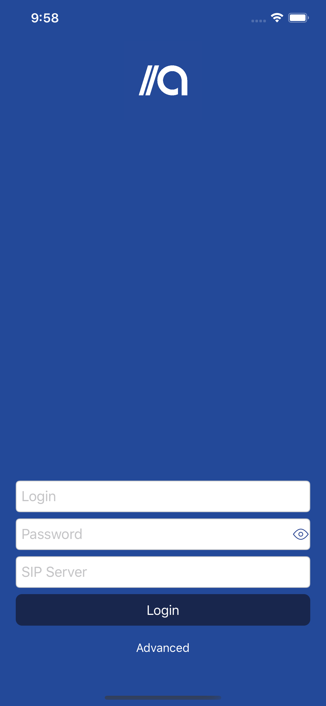
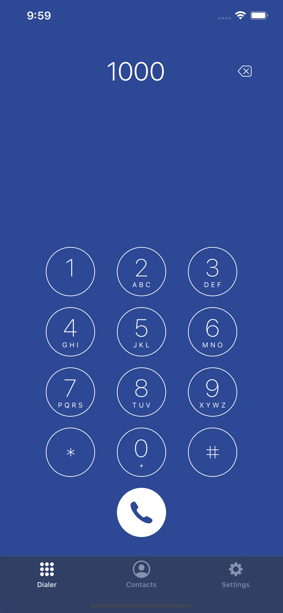
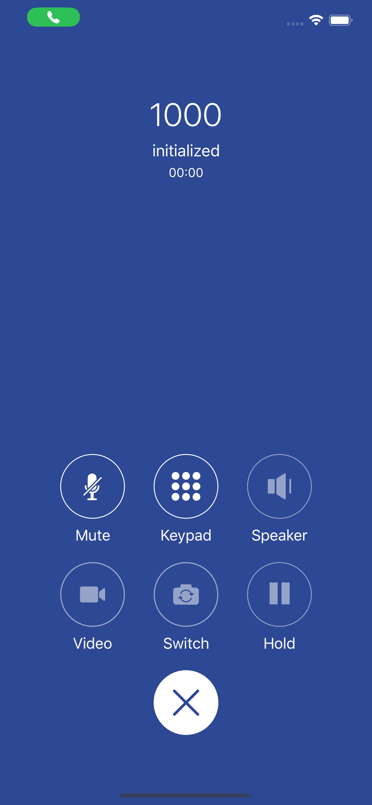

<div style="text-align:center;">
    
</div>

[](https://github.com/automat-berlin/afone/releases/)


[](https://cocoapods.org/)
[](LICENSE)
[](https://twitter.com/AutomatBerlin)

//afone is the reference implementation for SIP Telephony on iOS that can be used on different SIP stacks with no effort. It comes with an easily extensible adapters concept that encapsulates all details of various providers.

- [Requirements](#requirements)
- [Features](#features)
- [Usage](#usage)
- [Installation](#installation)
- [Customization](#customization)
- [FAQ](#faq)
- [Known Issues](#known-issues)
- [Contribute](#contribute)
- [Contact](#contact)
- [Acknowledgements](#acknowledgements)
- [License](#license)

## Requirements

* Xcode 10.2+
* Swift 5.0+
* iOS 12.1+
* CocoaPods 1.7.0+
* SIP-based Server / Service Provider

## Features

- [x] VoIP Adapter Reference Implementation
- [x] Voice & Video Calls
- [x] CallKit Integration
- [x] DTMF Support
- [x] Extensible Adapters Concept
- [x] Push Notifications (Local)
- [x] Background Connectivity
- [x] User-friendly Animations & Feedback
- [x] Brand / CI Customization

## Usage

Before you use the application, you have to look up your authentication credentials to a SIP-based server and make sure they are valid.



Enter your credentials (account, password, server). If your server uses a default configuration, you can log in right away.


In case you need to customize the application to your environment, tap **Advanced** and configure preferences like local & remote ports, transport protocols, STUN server, or TLS certificate validation.



Enter a phone number and make a call. You can tap on delete to revert your input.



//afone’s call interface supports all standard features. While making a call you can mute it, put it on the speaker, switch to a video call and switch the device camera. You can also tap on the **Keypad** button to enter DTMF signals.


In the **Settings** screen you can configure audio & video codecs, SRTP. You can also log out. The application will let you log in again afterwards.

## Installation

### Dependencies

//afone uses [CocoaPods](https://cocoapods.org) as its dependency manager. For usage and installation instructions, visit their website. Before you open & build the project in Xcode, you have to install all dependencies first. Make sure CocoaPods is installed on your machine, then install all required project dependencies:

```
pod install
```

### Build & Run

After you have installed all dependencies, just open the Xcode workspace. Select the desired simulator and run the project. If you want to run //afone on a device, you’ll have to configure signing in the Xcode Target preferences. Visit the official Apple documentation for more information about device provisioning.

## Customization

If you want to further customize the application you can either extend the reference `PortSIPAdapter` implementation, or preferably write your own adapter that conforms to the `VoIPManagerDelegate` protocol (and eventually other protocols if they are required by the 3rd-party client libraries you use).

### Configuration

Based on the configurations you provide, the application automatically creates a settings view that lets an user select supported preferences:

```swift
var audioCodecs: [Codec] { get }
```

Return supported audio codecs (e. g. G.729, PCMA, GSM, ILBC, SPEEX, OPUS).

```swift
var videoCodecs: [Codec] { get }
```

Return supported video codecs (e. g. H.263, H.264, VP8, VP9).

```swift
var srtpOptions: [SRTP] { get }
```

Return your supported SRTP options (e. g. none, prefer, force).

```swift
var localVideoView: UIView? { get }
```

Return your local video view here, which should be provided by your VoIP SDK.

```swift
var remoteVideoView: UIView? { get }
```

Return your remote video view here, which should be provided by your VoIP SDK.

### Delegation

Implement the following delegate functions if you want to create your own adapter:

```swift
func answerCall(_ sessionId: Int, videoCall: Bool, completion: (NSError?) -> Void)
```

```swift
func hangUp(_ sessionId: Int, completion: (NSError?) -> Void)
```

```swift
func hold(_ sessionId: Int, completion: (NSError?) -> Void)
```

```swift
func unhold(_ sessionId: Int, completion: (NSError?) -> Void)
```

```swift
func mute(_ sessionId: Int, mute: Bool, completion: (NSError?) -> Void)
```

```swift
func rejectCall(_ sessionId: Int, code: Int, completion: (NSError?) -> Void)
```

```swift
func sendDTMF(_ sessionId: Int, character: Character)
```

```swift
func createCall(to: String, completion: (Call?, NSError?) -> Void)
```

```swift
func initAdapter(credentials: Credentials, completion: @escaping (NSError?) -> Void)
```

```swift
func didEnterBackground()
```

To save battery, you should suspend connection to your backend.

```swift
func willEnterForeground()
```

Reestablish connection to your backend here, to be able to receive and make calls.

```swift
func logout(completion: (() -> Void)?)
```

```swift
func reload(with settings: Settings)
```

```swift
func startAudio()
```

```swift
func stopAudio()
```

```swift
func enableLocalVideo(_ enable: Bool, completion: ((Bool) -> Void)?)
```

```swift
func enableRemoteVideo(_ enable: Bool, completion: ((Bool) -> Void)?)
```

```swift
func toggleCameraPosition(completion: (NSError?) -> Void)
```

The function names represent common operations and should be self-explanatory. Depending on the backend you want to integrate, you either call other 3rd-party libraries, or implement your own communication & connection handling inside these functions. See `PortSIPAdapter` for a reference implementation.

### Colors & Other Defaults

You can customize colors and other defaults of the application in `Constants`. The structure holds customization options for call defaults, SIP defaults, or the keychain key name.

## FAQ

### Why do you have dependencies? I thought a good library shouldn’t have dependencies?

While it is technically correct that a good library should stand for itself without requiring other dependencies, //afone isn’t a library, but a complete softphone reference implementation with a full-fledged application architecture, dependency management, custom view components, and much more. Most of this functionality is a core part of the main repository, but there is no point in reinventing the wheel and writing the _n_-th implementation of a logging library (where already great implementations exist). If you think the project should further minimize its dependencies, we welcome your contribution and a pull request.

## Known Issues

The UI is not compatible with smaller displays (4", iPhone 5, iPhone 5s, iPhone SE).

## Contribute

We welcome any contributions. Contact us if you have any questions.

## Contact

//afone is owned and maintained by [Automat Berlin GmbH](https://automat.berlin/).

## Acknowledgements

Elevator Music by Kevin Macleod distributed under Attribution 3.0 Unported (CC BY 3.0)

## License

//afone is released under the MIT license. See [LICENSE](LICENSE) for details.
